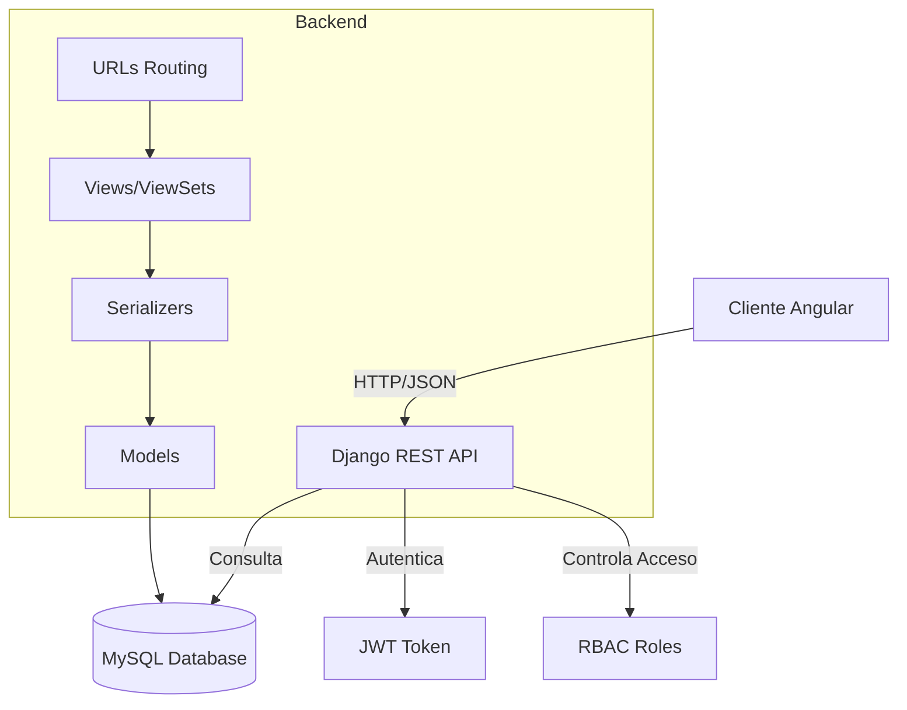

# Arquitectura del Sistema - Monitoreo-iot
## 🏛️ Diagrama de Arquitectura (Mermaid)

## 📐 Patrones de Diseño Utilizados
### 1. Model-View-Controller (MVC) - Estilo Django
- **Model:** `core/models.py` - Define la estructura de datos.
- **View:** `core/views.py` - Contiene la lógica de la API (ViewSets).
- **Controller (Routing):** `core/urls.py` y `config/urls.py` - Dirige las peticiones.
### 2. ViewSet Pattern (DRF)
Se utiliza `viewsets.ModelViewSet` para cada modelo, lo que proporciona automáticamente operaciones CRUD:
- `list()` - GET /recurso/
- `retrieve()` - GET /recurso/{id}/
- `create()` - POST /recurso/
- `update()` - PUT/PATCH /recurso/{id}/
- `destroy()` - DELETE /recurso/{id}/
### 3. Serializer Pattern
Conversión bidireccional:
- **Modelo → JSON:** Para respuestas de la API.
- **JSON → Modelo:** Para recibir datos y validarlos.
## 🔄 Flujo de una Petición
### Ejemplo: Obtener listado de dispositivos IoT
1. **Petición:** `GET /dispositivos/` desde Angular.
2. **CORS Middleware:** Verifica que el origen esté permitido.
3. **JWT Authentication:** Valida el token en la cabecera `Authorization`.
4. **URL Routing:** `core/urls.py` dirige a `DispositivoIotViewSet.list()`.
5. **ViewSet:** Consulta `DispositivoIot.objects.all()`.
6. **Serializer:** `DispositivoIotSerializer` convierte los objetos a JSON.
7. **Respuesta:** JSON con la lista de dispositivos.
## 🗃️ Esquema de Base de Datos (Resumen)
### Módulo de Usuarios
- `usuario` (1) --- (N) `usuario_has_rol` (N) --- (1) `rol`
- `rol` (1) --- (N) `recurso_has_rol` (N) --- (1) `recurso`
### Módulo IoT
- `zona_monitoreo` (1) --- (N) `dispositivo_iot`
- `dispositivo_iot` (1) --- (N) `sensor`
- `tipo_variable` (1) --- (N) `sensor`
- `sensor` (1) --- (N) `lectura_sensor`
- `tipo_variable` (1) --- (N) `lectura_sensor`
### Módulo Alertas
- `tipo_variable` (1) --- (N) `umbral_alerta`
- `estado_ambiental` (1) --- (N) `umbral_alerta`
- `lectura_sensor` (1) --- (N) `alerta`
- `umbral_alerta` (1) --- (N) `alerta`
## 🔐 Seguridad y Autenticación
### JWT (JSON Web Tokens)
- **Librería:** `djangorestframework-simplejwt`
- **Flujo:**
  1. POST `/login/` con username/password → devuelve `access` y `refresh` tokens.
  2. Las peticiones subsiguientes incluyen: `Authorization: Bearer <access_token>`.
  3. Si el token expira, se usa `/token/refresh/` con el refresh token.
### Control de Acceso (RBAC)
- Los roles se asignan a usuarios (`usuario_has_rol`).
- Los recursos (menú) se asignan a roles (`recurso_has_rol`).
- Al hacer login, el backend devuelve los recursos permitidos para construir el menú dinámico.
## 🌐 Configuración de Red y Despliegue
### Desarrollo
- **Backend:** `http://127.0.0.1:8000`
- **Frontend:** `http://localhost:5173` (Angular)
- **Base de datos:** SQLite (por defecto) o MySQL local.
### Producción (Railway)
- **URL:** `https://monitoreo-iot-production.up.railway.app`
- **Base de datos:** MySQL en Railway (switchyard.proxy.rlwy.net)
- **Archivos estáticos:** Servidos con Whitenoise.
## 📦 Dependencias Principales
Ver `requirements.txt` para la lista completa. Las más relevantes:
- `Django>=5.0`
- `djangorestframework>=3.17`
- `djangorestframework-simplejwt>=5.5`
- `mysqlclient>=2.2`
- `gunicorn>=25.0`
- `python-dotenv>=1.2`
- `whitenoise>=6.6`
---
**Nota:** Esta arquitectura está diseñada para ser escalable y seguir las mejores prácticas de Django y DRF.
