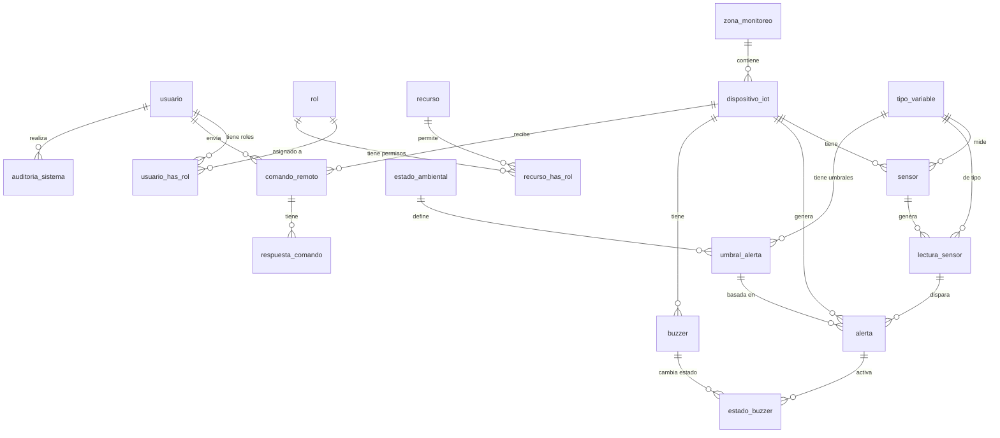

# Esquema de Base de Datos - Monitoreo-iot
## 🗄️ Diagrama Entidad-Relación (Mermaid)

## 🗄️ Lista de Tablas (18 total)
### 1. Tabla `usuario`
| Campo | Tipo | Descripción |
|-------|------|-------------|
| idusuarios | INT AUTO_INCREMENT | Clave primaria |
| nombre | VARCHAR(45) | Nombre del usuario |
| apellido | VARCHAR(45) | Apellido del usuario |
| username | VARCHAR(45) UNIQUE | Nombre de usuario (login) |
| password | VARCHAR(45) | Contraseña (texto plano - *inseguro*) |
### 2. Tabla `rol`
| Campo | Tipo | Descripción |
|-------|------|-------------|
| idrol | INT AUTO_INCREMENT | Clave primaria |
| nombre | VARCHAR(45) | Nombre del rol (Admin, Usuario, etc.) |
| estado | SMALLINT | 1=Activo, 0=Inactivo |
### 3. Tabla `recurso`
| Campo | Tipo | Descripción |
|-------|------|-------------|
| idRecursos | INT AUTO_INCREMENT | Clave primaria |
| nombre | VARCHAR(45) | Nombre del recurso (Dashboard, Dispositivos) |
| url_backend | VARCHAR(45) | URL del backend (opcional) |
| url_frontend | VARCHAR(45) | Ruta en Angular (ej. /dispositivos) |
| path | VARCHAR(45) | Ruta del componente |
| icono | VARCHAR(45) | Nombre del icono (ej. cpu, map) |
| orden | VARCHAR(45) | Orden en el menú |
| recurso_padre | VARCHAR(45) | ID de recurso padre (para submenús) |
| estado | VARCHAR(45) | 'activo' o 'inactivo' |
### 4. Tabla `usuario_has_rol`
| Campo | Tipo | Descripción |
|-------|------|-------------|
| usuario_idusuarios | INT | FK a usuario.idusuarios |
| rol_idrol | INT | FK a rol.idrol |
| *Clave única:* (usuario_idusuarios, rol_idrol) |
### 5. Tabla `recurso_has_rol`
| Campo | Tipo | Descripción |
|-------|------|-------------|
| recurso_idrecursos | INT | FK a recurso.idRecursos |
| rol_idrol | INT | FK a rol.idrol |
| *Clave única:* (recurso_idrecursos, rol_idrol) |
### 6. Tabla `zona_monitoreo`
| Campo | Tipo | Descripción |
|-------|------|-------------|
| id_zona | INT AUTO_INCREMENT | Clave primaria |
| nombre | VARCHAR(100) | Nombre de la zona |
| descripcion | TEXT | Descripción opcional |
| latitud | DECIMAL(10,7) | Coordenada latitud |
| longitud | DECIMAL(10,7) | Coordenada longitud |
| fecha_creacion | DATETIME | Fecha de registro (auto) |
### 7. Tabla `dispositivo_iot`
| Campo | Tipo | Descripción |
|-------|------|-------------|
| id_dispositivo | INT AUTO_INCREMENT | Clave primaria |
| id_zona | INT | FK a zona_monitoreo.id_zona |
| nombre | VARCHAR(100) | Nombre del dispositivo |
| mac_address | VARCHAR(50) UNIQUE | Dirección MAC única |
| modelo | VARCHAR(80) | Modelo del dispositivo |
| firmware_version | VARCHAR(50) | Versión de firmware |
| ip_actual | VARCHAR(45) | Dirección IP actual |
| estado | VARCHAR(20) | 'ACTIVO', 'INACTIVO' |
| ultima_conexion | DATETIME | Última vez conectado |
| fecha_registro | DATETIME | Fecha de registro (auto) |
### 8. Tabla `tipo_variable`
| Campo | Tipo | Descripción |
|-------|------|-------------|
| id_tipo_variable | INT AUTO_INCREMENT | Clave primaria |
| nombre | VARCHAR(80) | Nombre (Temperatura, Humedad) |
| unidad_medida | VARCHAR(20) | °C, %, etc. |
| simbolo | VARCHAR(20) | °C, % |
| estado | VARCHAR(20) | 'ACTIVO', 'INACTIVO' |
### 9. Tabla `sensor`
| Campo | Tipo | Descripción |
|-------|------|-------------|
| id_sensor | INT AUTO_INCREMENT | Clave primaria |
| id_dispositivo | INT | FK a dispositivo_iot.id_dispositivo |
| id_tipo_variable | INT | FK a tipo_variable.id_tipo_variable |
| nombre | VARCHAR(100) | Nombre del sensor |
| modelo | VARCHAR(80) | Modelo del sensor |
| pin_conexion | VARCHAR(20) | Pin de conexión (ej. A0, D1) |
| estado | VARCHAR(20) | 'ACTIVO', 'INACTIVO' |
| fecha_instalacion | DATE | Fecha de instalación |
### 10. Tabla `lectura_sensor`
| Campo | Tipo | Descripción |
|-------|------|-------------|
| id_lectura | BIGINT AUTO_INCREMENT | Clave primaria |
| id_sensor | INT | FK a sensor.id_sensor |
| id_dispositivo | INT | FK a dispositivo_iot.id_dispositivo |
| id_tipo_variable | INT | FK a tipo_variable.id_tipo_variable |
| valor | DECIMAL(10,2) | Valor de la lectura |
| fecha_hora | DATETIME | Fecha y hora (auto) |
### 11. Tabla `estado_ambiental`
| Campo | Tipo | Descripción |
|-------|------|-------------|
| id_estado_ambiental | INT AUTO_INCREMENT | Clave primaria |
| nombre | VARCHAR(80) | Nombre (Normal, Alerta, Peligro) |
| nivel | VARCHAR(20) | Nivel de severidad |
| color_referencia | VARCHAR(30) | Color (verde, amarillo, rojo) |
| prioridad | INT | Orden de prioridad |
### 12. Tabla `umbral_alerta`
| Campo | Tipo | Descripción |
|-------|------|-------------|
| id_umbral | INT AUTO_INCREMENT | Clave primaria |
| id_tipo_variable | INT | FK a tipo_variable.id_tipo_variable |
| id_estado_ambiental | INT | FK a estado_ambiental.id_estado_ambiental |
| valor_minimo | DECIMAL(10,2) | Valor mínimo del rango |
| valor_maximo | DECIMAL(10,2) | Valor máximo del rango |
| activo | BOOLEAN | Si el umbral está activo |
### 13. Tabla `alerta`
| Campo | Tipo | Descripción |
|-------|------|-------------|
| id_alerta | BIGINT AUTO_INCREMENT | Clave primaria |
| id_lectura | INT | FK a lectura_sensor.id_lectura |
| id_umbral | INT | FK a umbral_alerta.id_umbral |
| id_dispositivo | INT | FK a dispositivo_iot.id_dispositivo |
| titulo | VARCHAR(150) | Título de la alerta |
| mensaje | TEXT | Descripción detallada |
| estado | VARCHAR(20) | 'PENDIENTE', 'VISTA', 'RESUELTA' |
| fecha_generacion | DATETIME | Fecha de generación (auto) |
### 14. Tabla `buzzer`
| Campo | Tipo | Descripción |
|-------|------|-------------|
| id_buzzer | INT AUTO_INCREMENT | Clave primaria |
| id_dispositivo | INT | FK a dispositivo_iot.id_dispositivo |
| nombre | VARCHAR(100) | Nombre del buzzer |
| estado | VARCHAR(20) | 'APAGADO', 'ENCENDIDO' |
### 15. Tabla `estado_buzzer`
| Campo | Tipo | Descripción |
|-------|------|-------------|
| id_estado_buzzer | BIGINT AUTO_INCREMENT | Clave primaria |
| id_buzzer | INT | FK a buzzer.id_buzzer |
| id_alerta | INT | FK a alerta.id_alerta (puede ser NULL) |
| estado | VARCHAR(20) | 'ACTIVO', 'INACTIVO' |
| motivo_variacion | VARCHAR(255) | Razón del cambio |
| activado_por | VARCHAR(50) | 'SISTEMA', 'MANUAL' |
| fecha_hora | DATETIME | Fecha y hora (auto) |
### 16. Tabla `comando_remoto`
| Campo | Tipo | Descripción |
|-------|------|-------------|
| id_comando | BIGINT AUTO_INCREMENT | Clave primaria |
| id_dispositivo | INT | FK a dispositivo_iot.id_dispositivo |
| id_usuario | INT | FK a usuario.idusuarios |
| tipo_comando | VARCHAR(20) | Tipo de comando (REINICIAR, etc.) |
| payload | JSON | Datos adicionales del comando |
| fecha_creacion | DATETIME | Fecha de creación (auto) |
### 17. Tabla `respuesta_comando`
| Campo | Tipo | Descripción |
|-------|------|-------------|
| id_respuesta | BIGINT AUTO_INCREMENT | Clave primaria |
| id_comando | INT | FK a comando_remoto.id_comando |
| codigo_respuesta | VARCHAR(50) | Código de respuesta |
| mensaje | TEXT | Mensaje de respuesta |
| exitoso | BOOLEAN | Si el comando tuvo éxito |
| respuesta_json | JSON | Respuesta completa en JSON |
| fecha_respuesta | DATETIME | Fecha de respuesta (auto) |
### 18. Tabla `auditoria_sistema`
| Campo | Tipo | Descripción |
|-------|------|-------------|
| id_auditoria | BIGINT AUTO_INCREMENT | Clave primaria |
| id_usuario | INT | FK a usuario.idusuarios (puede ser NULL) |
| accion | VARCHAR(100) | Acción realizada |
| tabla_afectada | VARCHAR(100) | Tabla que se modificó |
| fecha_hora | DATETIME | Fecha y hora (auto) |
## 🔗 Diagrama de Relaciones (ER Simplificado)
usuario --< usuario_has_rol >-- rol --< recurso_has_rol >-- recurso
zona_monitoreo --< dispositivo_iot --< sensor --< lectura_sensor
tipo_variable <-- sensor
tipo_variable <-- lectura_sensor
tipo_variable --< umbral_alerta >-- estado_ambiental
lectura_sensor --< alerta >-- umbral_alerta
dispositivo_iot <-- alerta
dispositivo_iot --< buzzer --< estado_buzzer >-- alerta
dispositivo_iot --< comando_remoto >-- usuario
comando_remoto --< respuesta_comando
usuario --< auditoria_sistema
## 📝 Notas
- Todas las tablas usan `db_table` personalizada en los modelos Django.
- Se usan `AutoField` for primary keys (INT auto-incremento).
- Algunas claves foráneas apuntan a tablas con nombres de columna específicos (`db_column`).
- La tabla `lectura_sensor` y otras usan `BigAutoField` para manejar grandes volúmenes de datos.
